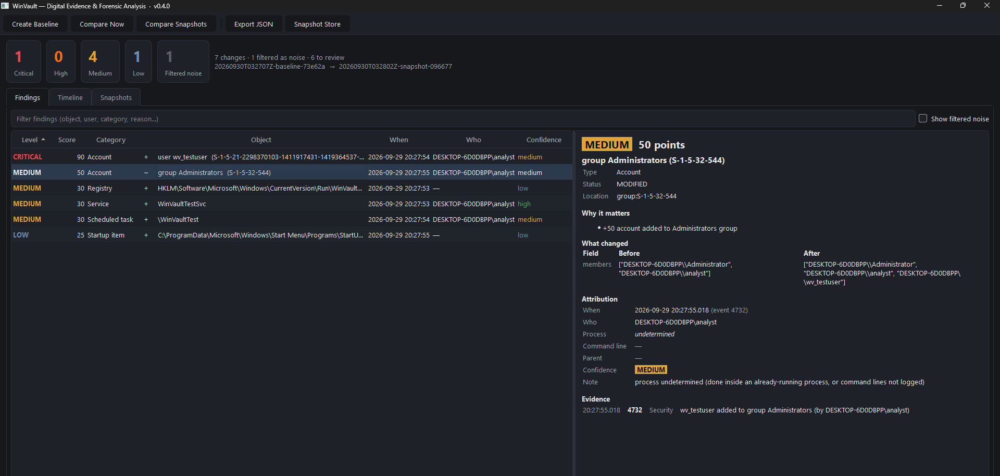

<p align="center">
  
</p>

<h1 align="center">WinVault — Digital Evidence &amp; Forensic Analysis</h1>

<p align="center">
  Take a snapshot of a Windows machine's security-relevant state, take another later, and find out
  <b>what changed, whether it matters, who did it, and what evidence proves it</b>.
</p>

<p align="center">
  <a href="https://github.com/M7MD-2030/WinVault/actions/workflows/ci.yml"></a>
  <a href="https://github.com/M7MD-2030/WinVault/releases/latest"></a>
  
  
  <a href="LICENSE"></a>
</p>



## Why WinVault?

Tools like Regshot show *every* difference between two points in time, and a normal Windows machine produces thousands of them in minutes. WinVault works differently:

| | |
|---|---|
| **Detect** | Collects only security-relevant state: autorun registry keys, services, scheduled tasks, local accounts and groups, startup folders, and critical system files. |
| **Filter** | Recognises normal Windows activity (Defender updates, Setup clean-up, built-in task rewrites) and sets it aside. Nothing is deleted, and you can always see why something was filtered. |
| **Analyze** | Scores each remaining change with explainable rules (Low / Medium / High / Critical) and lists the reasons. |
| **Correlate** | Ties each change to the Windows Event Log entries that name it, to show **when**, **who** and **which process**, with an honest confidence level. |
| **Report** | Desktop app, HTML/PDF report, or JSON. Snapshots are SHA-256-protected evidence. |

## Quick start: command line (no Python needed)

**1. Download** `winvault.exe` from the [latest release](https://github.com/M7MD-2030/WinVault/releases/latest). Optionally, verify it against `SHA256SUMS.txt`:
```powershell
Get-FileHash .\winvault.exe -Algorithm SHA256
```

**2. Install it once**, so `winvault` works from any terminal like `ls` or `git`. Open **Terminal (Admin)** in your Downloads folder:
```powershell
.\winvault.exe install
```
When `WinVault-GUI.exe` is in the same folder, this also adds **WinVault** to the Start menu and, on Windows 11, **pins it to the taskbar** with its icon (Explorer restarts once, and your other pins are kept; use `--no-pin` to skip). On Windows 10, pin it by hand: search WinVault in Start → right-click → *Pin to taskbar*. Then open a **new** Administrator terminal. As admin, it goes to `C:\Program Files\WinVault` for all users; without admin, it goes to your user folder, no admin needed.

**3. Use it:**
```powershell
winvault audit --enable              # one time: turn on the Windows evidence auditing
winvault baseline --label "clean"    # capture a known-good state
# ... later: after installing software, an update, or anything suspicious ...
winvault compare                     # what changed, does it matter, who did it?
winvault compare --html report.html  # same, plus an HTML report (Print → Save as PDF)
```

> **Updating later:** download [`scripts/Update-WinVault.ps1`](scripts/Update-WinVault.ps1) and run it from an Administrator PowerShell. It fetches the latest release, verifies the SHA-256 and reinstalls. Your snapshots are kept.

> The first time you run an unsigned new download, Windows SmartScreen may show *"Windows protected your PC"*. Click **More info → Run anyway** after checking the SHA-256.

## Commands

| Command | What it does |
|---|---|
| `winvault baseline [--label L]` | Capture and store a baseline (known-good state) |
| `winvault compare` | Capture now and compare against the latest baseline (`--against ID` for another) |
| `winvault diff A B` | Compare two stored snapshots (id prefixes) or snapshot `.json` files. Works offline, even on Linux |
| `winvault list` | Stored snapshots |
| `winvault verify` | Re-check every snapshot's SHA-256 (tamper check) |
| `winvault status` | Store, elevation and audit settings at a glance |
| `winvault audit [--enable]` | Show or enable the audit settings WinVault uses as evidence |
| `winvault install` / `uninstall` | Put `winvault.exe` on PATH and pin the app to the taskbar / remove both (snapshots are kept) |
| `winvault gui` | Open the desktop app |

Options for `compare` and `diff`:

| Option | |
|---|---|
| `--timeline` | Chronological view: process starts, audit events, changes |
| `--html FILE` / `--json FILE` | Self-contained HTML report / full machine-readable result |
| `--fail-on LEVEL` | Exit code **3** if any finding is at or above `low`/`medium`/`high`/`critical`, for scripts and scheduled checks |
| `--show-noise` | Also list what was filtered as normal Windows activity |
| `--only registry,tasks` | Limit to some collectors |
| `--no-events` | Skip Event Log correlation (faster) |

Exit codes: `0` ok · `1` error · `2` bad usage · `3` findings at or above `--fail-on`. Output is coloured in a terminal and plain when piped (`--no-color` or `NO_COLOR=1` to force plain). Snapshots are stored in `%ProgramData%\WinVault` (Administrators only), or wherever `--store DIR` / `WINVAULT_STORE` points.

```powershell
# example: a nightly check that only complains when something serious changed
winvault compare --fail-on high --html "C:\Reports\winvault-$(Get-Date -f yyyyMMdd).html"
if ($LASTEXITCODE -eq 3) { Write-Warning "WinVault found High/Critical changes" }
```

## Desktop app

Prefer windows and buttons? Download **`WinVault-GUI.exe`** from the same release (or run `winvault gui` from a source install). It runs the same analysis:

1. **One time:** *Tools → Enable Auditing*
2. **Create Baseline** while the machine is in a known-good state
3. Later, **Compare Now**, then review findings from most severe down (click one for why / who / evidence)
4. **Export Report…** for the HTML report

## What you get for each finding

```
[CRIT]  90p [+] users     user backup_admin  (S-1-5-21-...-1007)
        +90 new local user created directly in Administrators
        when: 2026-09-29 20:14:32  (event 4720)
        who:  DESKTOP-6D0DBPP\analyst   process: undetermined   confidence: medium
        evidence: [4720] user account created: backup_admin (by DESKTOP-6D0DBPP\analyst)
        evidence: [4732] backup_admin added to group Administrators (by DESKTOP-6D0DBPP\analyst)
```

- **Score and reasons**: every point is explained, so there's never a bare "CRITICAL".
- **Attribution confidence**:
  - **high**: an audit event *and* a process command line both name the object
  - **medium**: an audit event gives who and when
  - **low**: only the artifact's own timestamp is available
  - **none**: no evidence
- **Links are made on the object itself** (account SID, service name, task path), never on "whatever process ran last". When the evidence isn't there, WinVault says *undetermined* instead of guessing.
- **Alerts**: a cleared Security or System log between the two snapshots is flagged, as is a log too small to reach back to the baseline.

## What WinVault watches

| Area | Source | Evidence used |
|---|---|---|
| Autorun registry | Run/RunOnce, Policies\Explorer\Run (machine + every loaded user), Winlogon Shell/Userinit, AppInit_DLLs, BootExecute, LSA packages | key last-write time, process command line |
| Services | `HKLM\SYSTEM\CurrentControlSet\Services` | System 7045 / 7040, Security 4697, 4688 |
| Scheduled tasks | `System32\Tasks` definitions (actions, triggers, principal, run level, hidden) | Security 4698 / 4699 / 4702, Task Scheduler 106 / 140 / 141 |
| Accounts & groups | Local users, groups, Administrators membership | Security 4720–4738, 4732 / 4733 |
| Startup folders | All users + every profile, SHA-256 | file timestamps, process command line |
| Critical files | `drivers\etc\hosts`, `networks`, `protocol`, `services`, `lmhosts.sam`, SHA-256 | content hash |

## Good to know

- **Run it as Administrator.** Without elevation, scheduled tasks, other users' registry hives and the Security log are out of reach, and WinVault tells you so.
- **Enable auditing early.** Windows only records who did what from the moment auditing is on, so changes made before that can't be attributed after the fact.
- **Take baselines regularly.** Event logs roll over. A baseline from months ago still detects changes, but the evidence of who made them may be gone, and WinVault warns you when that happens.
- **What it isn't:** WinVault compares two points in time. It is not real-time monitoring, antivirus or EDR, and it doesn't block anything.
- **Privacy:** snapshots and reports contain account names, SIDs and paths from the machine. Store and share them like any other evidence.

## Install from source

```powershell
git clone https://github.com/M7MD-2030/WinVault.git
cd WinVault
py -m venv .venv; .\.venv\Scripts\Activate.ps1
pip install -e ".[gui]"        # add ,dev for tests
winvault gui
```

## Documentation

| | |
|---|---|
| [Development & testing](docs/DEVELOPMENT.md) | Architecture, running tests, the isolated test lab |
| [Test lab VM](docs/VM_SETUP.md) | Building a disposable Windows VM on KVM/libvirt for safe testing |
| [Roadmap](docs/ROADMAP.md) | Design by phase and what's next |
| [Changelog](CHANGELOG.md) | Release history |
| [Contributing](CONTRIBUTING.md) · [Security policy](SECURITY.md) | How to help / how to report a vulnerability |

## License

[MIT](LICENSE) © M7MD-2030. WinVault is a defensive tool. Use it on systems you own or are authorised to examine.
