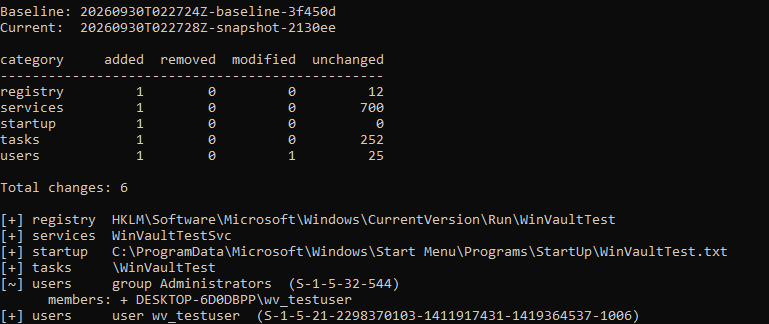

# WinVault — Digital Evidence & Forensic Analysis

> Security-focused change analysis for Windows. Capture a baseline, let the system run, capture again, and find out **what changed, whether it matters, and why**.




Tools like Regshot show *every* difference between two points in time, and a normal Windows machine creates thousands of them in minutes. WinVault collects only **security-relevant** state (persistence locations, services, scheduled tasks, accounts, startup items), compares it, and (in upcoming phases) filters out the noise, scores what's left with explainable rules, and ties each finding back to Windows Event Log evidence.

```
Detect → Filter → Analyze → Correlate → Explain → Report
```

## Status

| Phase | Scope | Status |
|---|---|---|
| **1 — MVP** | Registry, Services, Scheduled Tasks, Users & Groups, Startup collectors · snapshot store · comparison engine · CLI | ✅ done |
| **2** | Noise filtering · rule-based risk scoring · explanations | ✅ done |
| **3** | Event Log collection · correlation (who / when / which process) · timeline | ✅ done |
| **4** | Desktop app (PySide6) · dashboard · change details · timeline · snapshot manager | ✅ done |
| 5 | HTML/PDF/JSON reports · file hashing · packaging (PyInstaller) | planned |

See [`docs/ROADMAP.md`](docs/ROADMAP.md) for the full design.

## What Phase 1 collects

| Collector | Source | Key fields |
|---|---|---|
| `registry` | Run / RunOnce / Policies\Explorer\Run (HKLM + every loaded user hive), Winlogon `Shell`/`Userinit`, `AppInit_DLLs`, `BootExecute`, LSA packages, `UserInitMprLogonScript` | value, type, owning SID, key last-write time |
| `services` | `HKLM\SYSTEM\CurrentControlSet\Services` | image path, ServiceDll, start type, account |
| `tasks` | `%SystemRoot%\System32\Tasks` XML | actions, triggers, run-as principal, run level, hidden flag, SHA-256 |
| `users` | Local users & groups | enabled, groups, admin membership, password metadata |
| `startup` | All-users + per-profile Startup folders | SHA-256, size, timestamps |

## Analysis (Phase 2)

`winvault compare` no longer just lists differences — it filters known Windows noise and scores what's left:

- **Noise filter** tags expected churn (Defender platform updates, Setup's `defaultuser0`, Microsoft task-hash rewrites, per-user service instances) and hides it by default. Noise is tagged with a reason, never deleted, and `--show-noise` reveals it. Every rule matches tightly — the same binary moving to the *official* directory — so a look-alike path can't hide in it.
- **Risk scoring** adds explainable points per finding and maps the total to Low / Medium / High / Critical (0–29 / 30–59 / 60–79 / 80+). The reasons list *is* the justification, so you never see a bare "CRITICAL":

```
9 changes: 3 filtered as noise, 6 to review (critical 1, high 0, medium 4, low 1)

[CRIT]  90p [+] users     user wv_testuser  (S-1-5-21-...-1004)
        +90 new local user created directly in Administrators
[MED ]  50p [~] users     group Administrators  (S-1-5-32-544)
        +50 account added to Administrators group
        members: + DESKTOP\wv_testuser
```

Add `--json report.json` for the full detail, including each finding's `analysis` block.

## Correlation & timeline (Phase 3)

`winvault compare` also reads the Windows Event Logs for the exact window between the baseline and now, stores them **inside the hash-protected snapshot**, and ties each finding to the evidence that names it:

| Change | Evidence used |
|---|---|
| new / removed / changed user | Security 4720 · 4722 · 4724 · 4725 · 4726 · 4738 (matched on the account SID) |
| group membership | Security 4732 · 4733 (matched on group SID + member SID) |
| service | System 7045 · 7040, Security 4697 (service name / image path) |
| scheduled task | Security 4698 · 4699 · 4702, Task Scheduler 106 · 140 · 141 (task path) |
| responsible process | Security 4688 whose command line names the object (whole-word match) |
| anti-forensics | Security 1102 / System 104 — **audit log cleared** raises an alert |

Links are made on the **target** (SID, service, task path) — never on "the last process that ran before it", which is how tools confidently blame the wrong program. Every finding carries an honest confidence:

- **high**: an audit event and a process command line both name the object
- **medium**: an audit event gives who + when, but the process is unknown
- **low**: only the artifact's own timestamp (e.g. registry key last-write time)
- **none**: nothing in the logs relates to it, and the report says so

```
[MED ]  30p [+] services  WinVaultTestSvc
        +30 new service registered
        when: 2026-09-30 05:42:03  (event 7045)
        who:  analyst   process: C:\Windows\System32\sc.exe   confidence: high
        cmd:  sc.exe create WinVaultTestSvc binPath= "C:\Windows\System32\notepad.exe" start= demand
```

`--timeline` prints everything in order: process starts, audit events and the changes they produced. Windows doesn't record most of this by default, so run **`scripts\Enable-WinVaultAuditing.ps1`** once (as admin). WinVault warns you when auditing is off instead of silently guessing.

## Evidence handling

Every snapshot is written once as JSON and its SHA-256 is recorded in `index.json`. Every load re-hashes the file and refuses to use it if it has changed, and `winvault verify` checks the whole store. Volatile fields such as timestamps are kept as evidence but never count as a "modification".

## Desktop app (Phase 4)

```powershell
pip install -e ".[gui]"
winvault gui          # or: winvault-gui
```

The app runs the same pipeline as the CLI, so both always show the same results:

- **Dashboard tiles**: Critical / High / Medium / Low / filtered noise
- **Findings table**, sorted by severity, with a filter box and a *Show filtered noise* toggle
- **Details pane** for the selected finding: why it matters (score breakdown), what changed (before/after), attribution (when, who, which process, command line, confidence) and the evidence events
- **Timeline** tab with process starts, audit events and changes in order
- **Snapshots** tab: every stored snapshot, a one-click integrity check, and a comparison of any two (works offline, even on Linux)
- Alerts (e.g. *audit log cleared*) and coverage warnings in a banner. Slow work runs in the background, so the window never freezes.

Run it as Administrator. It tells you when it isn't elevated.

## Quick start

Run these on Windows from an **elevated** terminal:

```powershell
git clone https://github.com/M7MD-2030/WinVault.git
cd WinVault
py -m venv .venv; .\.venv\Scripts\Activate.ps1
pip install -e ".[dev,gui]"

winvault baseline --label "clean install"
# ... use the machine, install something, etc ...
winvault compare --json report.json
```

Other commands:

```powershell
winvault list                      # stored snapshots
winvault verify                    # re-hash every snapshot (tamper check)
winvault diff <idA> <idB>          # compare two stored snapshots
winvault diff a.json b.json        # compare snapshot files — works on Linux too
winvault compare --only registry,tasks
winvault compare --timeline        # chronological evidence view
winvault compare --show-noise      # include changes filtered as normal Windows activity
winvault compare --no-events       # skip Event Log correlation
```

The snapshot store defaults to `%ProgramData%\WinVault`. Override it with `--store DIR` or `WINVAULT_STORE`.

### Verify detection

`scripts/Test-WinVaultChanges.ps1` makes one harmless, clearly labelled change per collector. Each change points at `notepad.exe` and nothing is ever executed. Run it only in your test VM:

```powershell
winvault baseline --label clean
.\scripts\Test-WinVaultChanges.ps1
winvault compare
.\scripts\Test-WinVaultChanges.ps1 -Cleanup
```

CI runs this exact loop on a GitHub Windows runner on every push.

## Lab setup

See [`docs/VM_SETUP.md`](docs/VM_SETUP.md) for building the Windows development VM on KVM/libvirt.

## Architecture

```
winvault/
├── collectors/      # one module per artifact source → {stable_key: attributes}
├── snapshot.py      # Snapshot Manager: capture, store, hash-verify
├── compare.py       # Comparison Engine: added / removed / modified / unchanged
├── models.py        # Change, FieldChange, ComparisonResult
└── cli.py           # command line (GUI arrives in Phase 4)
```

To add a collector, subclass `Collector`, return `{key: {...}}` from `collect()`, and register it in `collectors/__init__.py`. The comparison engine needs no changes.

## Disclaimer

WinVault is a defensive forensics and education project. Run it only on systems you own or are authorised to examine. Snapshots contain host details such as usernames, SIDs and paths, so don't commit or share them.

## License

MIT, see [LICENSE](LICENSE).
